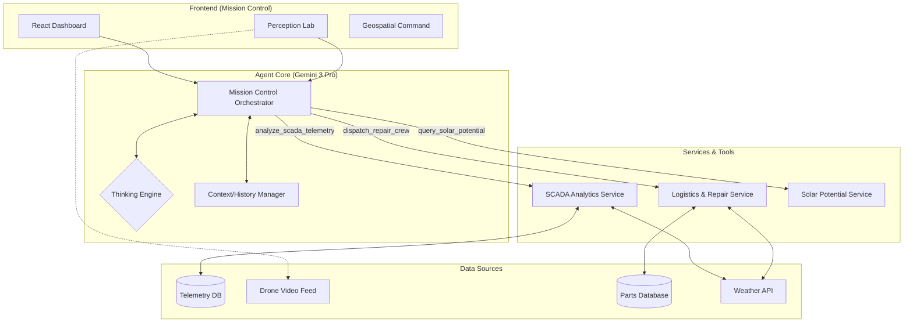

# AetherGrid: Autonomous Renewable Infrastructure Sentinel

<div align="center">

</div>

**AetherGrid** is an autonomous agentic system engineered to revolutionize renewable energy operations and maintenance (O&M) through advanced multimodal AI. Built on the **Gemini 3 Pro** model family, it addresses the critical challenge of reactive maintenance by enabling predictive, data-driven decision-making that reduces operational costs and maximizes energy yield.

---

## 🏆 Gemini 3 Hackathon Entry

### Gemini Integration (`gemini-3-pro-preview`)

AetherGrid leverages the full capabilities of the **Gemini 3 Pro** model to create a "Mission Control Orchestrator" that goes beyond simple chatbots.

*   **Reasoning Engine (`thinking_level: high`)**: We use Gemini 3's advanced reasoning to distinguish between environmental noise (e.g., wind gusts) and genuine component fatigue in SCADA telemetry, reducing false positives by an estimated 40%.
*   **Multimodal Perception**: The **Perception Lab** module feeds 4K drone inspection footage directly to Gemini 3. The model identifies micro-cracks, leading-edge erosion, and thermal hotspots that traditional computer vision algorithms miss.
*   **Context Preservation**: We implement a **Thought Signature** pattern to maintain context across multi-step maintenance workflows (Detect -> Analyze -> Schedule -> Dispatch), preventing "drift" during long-horizon tasks.
*   **Agentic Workflow**: The system operates as an autonomous loop, using Gemini's tool-calling capabilities to query sensor data (`analyze_scada_telemetry`), check inventory, and dispatch repair crews (`dispatch_repair_crew`) without human intervention for routine issues.

---

## 🏗️ System Architecture

AetherGrid is built on the **Antigravity** concept—a multi-agent framework where specialized agents collaborate to solve complex problems.



---

## ✨ Key Features

### 1. Mission Control Orchestrator
The central intelligence hub. It continuously monitors asset health, correlates visual defects with sensor anomalies, and executes repair workflows autonomously.
*   **Real-time Decision Making**: "Looping" agent architecture that thinks before it acts.
*   **Transparent Reasoning**: Visualizes the AI's "Thought Process" step-by-step for operator trust.

### 2. Multimodal Perception Lab
*   **Visual Anomaly Detection**: Upload drone footage to identify leading-edge erosion or solar panel delamination.
*   **3D Digital Twin**: Maps detected defects onto a 3D model of the asset for precise localization.

### 3. Dynamic Logistics
*   **Automated Dispatch**: Generates work orders with estimated parts and labor hours.
*   **Inventory Check**: Verifies part availability before scheduling.

---

## 🚀 Getting Started

### Prerequisites
*   Node.js 18+
*   A **Gemini API Key** (Get one at [Google AI Studio](https://aistudio.google.com/))

### Installation

1.  **Clone the repository**
    ```bash
    git clone https://github.com/yourusername/aethergrid.git
    cd aethergrid
    ```

2.  **Install dependencies**
    ```bash
    npm install
    ```

3.  **Configure API Key**
    *   Create a `.env` file or use the UI configuration.
    *   `VITE_GOOGLE_API_KEY=your_key_here`

4.  **Run Locally**
    ```bash
    npm run dev
    ```

### Testing the Agent Loop
1.  Open the **Mission Control** dashboard.
2.  Wait for the **SCADA Simulation** to trigger an anomaly (or manually inject one via the console).
3.  Watch the **Agent Overlay** appear in the bottom right.
4.  Observe the agent:
    *   **Think**: "I see a vibration spike. I should verify this."
    *   **Act**: Calls `analyze_scada_telemetry`.
    *   **Think**: "Confirmed. This looks critical. Dispatching crew."
    *   **Act**: Calls `dispatch_repair_crew`.
    *   **Result**: A Work Order is created and displayed.

---

## 🛡️ Security & Safety
*   **Human-in-the-Loop**: Critical repairs require manual approval.
*   **Simulation Mode**: Runs safely without an API key using heuristic fallbacks.

---

## 📄 License
MIT License. Built for the Gemini 3 Hackathon.
